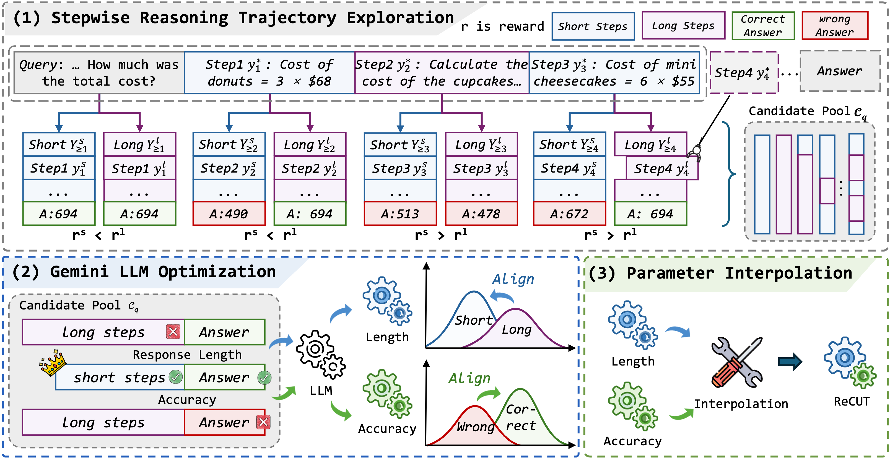

# ReCUT:Balancing Reasoning Length and Accuracy in LLMs via Stepwise Trails and Preference Optimization

# Overview

 ReCUT employs a stepwise exploration mechanism and a long-short switched sampling strategy, enabling LLMs to incrementally generate diverse reasoning paths. These paths are evaluated and used to construct preference pairs to train two specialized models (Gemini LLMs)——one optimized for reasoning accuracy, the other for shorter reasoning. A final integrated model is obtained by interpolating the parameters of these two models.

# Set up
**Use `git clone` to download this project**
```
git clone https://github.com/jinzhensheng/ReCUT.git
cd ReCUT
```
**To prevent conflicts between packages, we mainly use three virtual environment management packages, one for constructive data and evaluate、 one for model training and for model merge.**

```
for constructive data and evaluate, please:
cd Data
conda env create -n data_eva -f data_environment.yml

for model training, please:
conda env create -n long-short -f training_environment.yml

for model merge, please:
conda env create -n mergekit -f merge_environment.yml
```

# Data
Download the files from [here](https://huggingface.co/datasets/agentica-org/DeepScaleR-Preview-Dataset)
Use the downloaded data to synthesize the data using the following scripts
```
conda activate data_eva
python src/long2short_reward_generate.py
--model_path # The path to model
--tensor_parallel_size # Tensor Parallel Size
--max_model_len 8096
--gpu_memory_utilization 0.95
--dataset_path # Input DeepScaleR dataset paths
--output_dir # Output directory (default: . /result) 
--sample_size 8000
--batch_size #
--num_iterations 8
--temperature 0.7
--top_p 0.95
--max_tokens 2048
--alpha 1
--beta 1
--random_seed 42
--analyze_only #
--result_path # Path to the result file to be analyzed (only used in analyze_only mode)
```
The script generates two thing pool json files, a selection result json file and an optimal solution json file

# Construct dpo data
First:Use the following script to slice the correct optimal solution
```
python src/long2short_split_optimal.py
--input # Path to the optimal json file
--output_correct #
--intput_correct #
```
Second:Construct two DPO training data using the correct optimal solution and two think tanks to train two DPO models, one length-optimized model and one accuracy-optimized model
```
python src/long2short_dpo.py
--optimal # Correctly optimize the path to the json file
--pooling # Thing Pool Path
--output # Output File Path
```
# DPO
Our DPO training uses LLaMA Factory, and the specific training parameters can be found in our dpo.yaml file.

# Merge Model
Our model merging reference is Mergekit, Please refer to the specific Mergekit documentation for usage. which uses the following script for model merging.

```
Merging models requires modifying the dare_ties.yml file, which is located in the folder examples
cd mergekit
mergekit-yaml Path to the dare_ties.yml file Output path of the merged model
```


